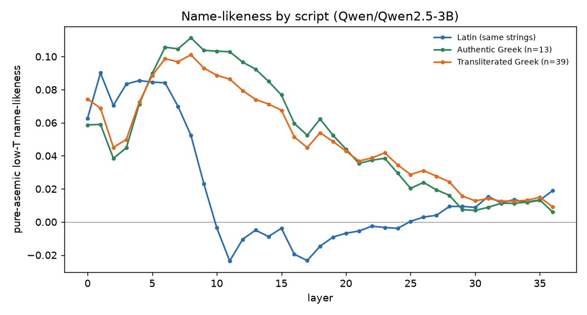
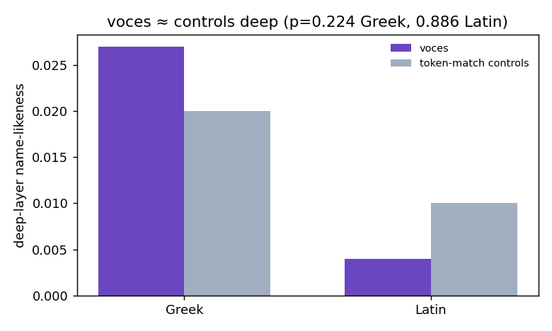

# It's the Script, Not the Spell

**A voces-negative result on deep representation in language models, and what survives it.**

This repository studies how a transformer represents the *voces magicae* — the "barbarous names" of the Greek Magical Papyri (PGM), strings their own tradition holds to be efficacious through *form* rather than meaning. They are a clinical, meaning-evacuated probe of how a model encodes the boundary between language, name, and ornament: language deliberately built to operate *without reference*, used to probe a system that processes the form of tokens with no native concept of what they point to.

> **TL;DR.** A 7B-class model (Qwen2.5) *does* recognize the orthographic **texture** of a barbarous name — cleanly, on sight, at the embedding/early layers (H1: ~0.89–0.94 separable from token-matched nonsense, beyond a surprisal baseline, robust to a within-family scale change (3B↔7B) and de-quantization; cross-family untested). But that recognition is **shallow**: it washes out by mid-network. An intermediate run suggested name-likeness *persists deep in Greek script*; a control dissolved it — token-matched **nonsense** in Greek persists deep just as much as the voces do (voces +0.027 vs controls +0.020; *p* = 0.224, n = 49). The deep-Greek effect is a fact about **Greek-script processing**, not about the voces. Geometry bought adjacency, not aboutness; the adjacency is surface; the depth was Greek, not magic.

This is a **negative result, reported as a result.** It is, as the study's own design anticipated, a pointed comment on what subword tokenization does to exactly the language the magicians thought most powerful.

---

## The finding in two figures

**The lead that did not survive** — name-likeness by script. Latin (same strings) peaks early and dies by mid-stack; the Greek conditions ride high and persist. This *looked* like "the grain runs deeper in Greek."



**The decider** — voces vs. token-matched controls, deep layers, by script. In Greek the matched nonsense persists almost as much as the voces; the difference is not significant. The persistence is the script, not the voces.



---

## What's here

| path | contents |
|------|----------|
| `paper/its-the-script-not-the-spell.docx` | the working paper (ICMI WP No. 27 — *Institute for a Christian Machine Intelligence*, a **self-published, non-peer-reviewed** series; **not** the ACM ICMI conference) |
| `paper/study-spec.md` | the full pre-registration-grade study spec (hypotheses, cohorts, confound catalog, falsifiers) |
| `results/voces_v6_results.json` | **canonical results** — genuine end-to-end run-output (seed 0) incl. the `voces_specificity` decider object (what the figures read) |
| `results/voces_v6_frozen_controls.json` | the exact model-generated stimuli — 76 self-contained token-matched **pairs** (`dtok`/`dsurp` deltas) + anchor cohorts; verify the isomorphism without rerunning extraction |
| `results/voces_v5_results.json` | the same seed-0 run *before* the decider object was serialized (kept for provenance) |
| `results/voces_v5_breakage.txt` | the auto-filled breakage / surprise log |
| `results/fig1`, `fig2` | the two figures above, **regenerated from the JSON — no values hard-coded** (`src/make_figures.py`) |
| `notebooks/voces_residual_stream_v6_*.ipynb` | the runnable Colab pipeline (cohort build → tokenizer-match → extract → probe → split → decider) |
| `src/build_notebook.py` | generator for the notebook above — the canonical source of the pipeline code |
| `src/make_data.py` | builds `data/` from the corpus definitions (CPU, no model) |
| `src/make_figures.py` | regenerates both figures from `results/voces_v6_results.json` — **reads every value from the JSON, nothing hard-coded** (CPU, no model) |
| `src/steer_interventions.py` | activation-steering scaffold for the H4 arm — **unrun; no result is claimed.** Its only valid target is H1's *surface* texture, **not** the H2 deep representation (steering toward a rep we showed is indistinguishable from control, p=0.224, would probe a thing we have evidence isn't there) |
| `data/voces.jsonl` | the 76 barbarous-name strings (public-domain attestations) + our analysis tags; **no copyrighted Betz text** |
| `data/theonym_roots.json`, `data/anchor_controls.json` | theonym lexicon + name/word/random anchor cohorts |

### Which file is canonical for which claim

| claim | canonical artifact |
|-------|--------------------|
| H1 separability (peaks, surprisal baseline) | `results/voces_v6_results.json` → `h1` |
| H2 name-likeness sweep by script | `results/voces_v6_results.json` → `sweep_low_pa_mean`, `greek_split` (→ Fig 1) |
| **the decider** (voces vs controls, deep) | `results/voces_v6_results.json` → `voces_specificity` (→ Fig 2) |
| the runnable pipeline | `notebooks/voces_residual_stream_v6_*.ipynb` (generated by `src/build_notebook.py`) |
| the corpus | `data/voces.jsonl` (built by `src/make_data.py`) |

The notebook is **v6** and the canonical results JSON is **v6**; `voces_v5_results.json` is the identical
seed-0 run kept only to show the decider object was *added*, not changed. Reproduce end-to-end by running the
v6 notebook (it writes `voces_specificity` directly). CI (`.github/workflows/ci.yml`) checks that every source
file parses, the corpus rebuilds, the decider object is present, and both figures regenerate from the JSON.

## The hypotheses, and how each landed

| | hypothesis | verdict |
|---|------------|---------|
| **H1** | the model separates voces from token-matched controls | **confirmed** — 0.89–0.94, beats surprisal by +0.38, survives a within-family scale change (3B↔7B) + de-quantization (cross-family untested) |
| **H2** | name-likeness is **voces-specific** and survives into deep layers | **not supported** — shallow in both scripts; deep-Greek effect is not voces-specific (voces ≈ controls, p=0.224) |
| **Falsifier #1** | name-likeness is entirely the embedded theonyms | refuted — theonym split null |
| **Falsifier #4** | separability is surprisal in disguise | refuted — surprisal baseline near chance |
| **script migration** | abstract form survives a script change | mis-attributed — the effect is the *script*, not the form (see the decider) |

*Probe: L2-regularized logistic regression on mean-pooled residual-stream activations, **GroupKFold
cross-validation by string-family** (so "separable" means out-of-family generalization, not memorization of
individual strings).*

## The honest hedge

The voces > control point estimate leans the predicted way (+0.007 in Greek) but **sits inside the noise at n=49** (p=0.224). So the strong claim — a deep, voces-specific representation — is **unsupported at this power, not disproven.**

Two distinct uncertainties, and we only quantify one: the p=0.224 is across **strings** (n=49) — it measures *string-sample* variance. **Run variance is unestimated**: this is a single seed (n_seeds=1), so we have *zero* estimate of how much the decider moves across runs. "Unsupported at this power" quantifies string power only; seed power is not yet bounded. A multi-seed (≥3) repeat is in future work precisely to put numbers on the pilot-weight caveat. A higher-power, cross-family 7B-fp16 run could then revisit whether a small voces-specific deep residual exists beneath the script effect. The MVP conclusion is deflationary, and the paper states it plainly.

## How this result was reached (and why that matters)

Twice the data teased the romantic reading ("the model holds these as names of power"); twice the next probe deflated it. The authentic-vs-transliterated split killed a transliteration confound and left "Greek persists deep" standing; the voces-vs-controls-in-Greek probe then showed that persistence was never about the voces. The deep-namehood reading was not refuted by argument but **dissolved by a control** — the same-script control the design demanded. An earlier draft titled *"The Grain Runs Deeper in Greek"* headlined the claim before that control ran; it is retained in the git history as a retracted draft, because the retraction *is* part of the method.

## Reproducing

The pipeline runs on a single Colab GPU (T4 is enough; Qwen2.5-7B in 4-bit, or 3B in fp16). The decisive numbers reproduce on CPU from the bundled JSON:

```bash
python src/make_data.py           # builds data/ (corpus + controls) from the notebook's definitions
python src/make_figures.py        # regenerates both figures from results/voces_v6_results.json (decider read from JSON)
```

Full extraction (needs a GPU) regenerates per-(string × layer) residual-stream activations:

1. Open `notebooks/voces_residual_stream_v6_voces-specificity.ipynb` in Colab → **Runtime → GPU (T4)** → **Run all**. It auto-selects Qwen2.5-7B (4-bit) on a T4, or set `CONFIRM_FP16 = True` for the un-quantized 3B confirmation run. It writes `voces_v6_results.json` + `voces_v6_breakage.txt`.
2. To edit the pipeline, change `src/build_notebook.py` and run it to regenerate the notebook — that file is the single source of truth for every cell.

See `paper/study-spec.md` §11 for the cohort-build → extract → probe → split pipeline in full.

## Provenance & integrity

See [`PROVENANCE.md`](PROVENANCE.md) for: model revision, seed, the token-match quality figures, the four off-spec improvisations recorded during the run (surprisal-as-rarity-proxy; algorithmic Greek transliteration; corpus curated from PGM knowledge rather than a parsed Betz edition), and the citation-verification log. All external references were verified against live sources; the one self-published reference (ICMI WP 26) is labeled as such.

## Status

Single-model, single-tokenizer, single-seed pilot (Qwen2.5-3B). **Limitations, most-fragile first:**
1. **The Greek arm rests on a single tokenizer.** The deep-Greek finding is downstream of *one* tokenization scheme — this is where the result is most fragile, and a cross-tokenizer/cross-family check is the first thing that could move it.
2. **Single seed** — run-variance is unestimated (the p=0.224 is string-sample variance only; see *The honest hedge*).
3. **Within-Qwen-family only** (3B↔7B) — cross-family (Llama, Gemma) untested.

The H1 result is robust within those bounds; the central H2 *negative* is the claim, stated at pilot weight. The script-asymmetry side-finding (Greek-script tokens held name-adjacent deeper than Latin) is real and incidental — a fact about script processing, flagged for follow-up, not a result about ritual language.

## Future work

- **Cross-family replication (Llama, Gemma, Mistral).** H1 and the Greek finding are within-Qwen-family only; the Greek effect specifically is downstream of a single tokenizer. **A ready-to-run harness is included:** `notebooks/voces_crossfamily.ipynb` reuses every science cell unchanged and only swaps the model — pick Gemma-2-9B / Llama-3.1-8B / Mistral-7B (a *different tokenizer* is the test, not raw scale; Llama-405B does not fit Colab), and the model-tagged results JSON drops straight into a comparison against the Qwen decider.
- **Multi-seed (≥3) repeat.** Bounds run-variance, which a single seed leaves unestimated — turns "pilot weight" from a hedge into a quantified uncertainty.
- **Is the deep-Greek effect latent distributional *namehood*, not pure orthography? — *with its falsifier attached.*** A reviewer's hypothesis: Greek tokens may skew proper-name/theonym in pretraining, so deep-Greek persistence could be real distributional namehood rather than surface orthography. **This is the romantic-reading shape, and it does not enter the repo without its killer:** render *non-name* Greek strings (function words, numerals, common nouns) and test whether they persist deep too. If they do → pure script-processing, hypothesis dead. Only if *name-plausible* Greek alone persists is there a namehood effect worth chasing. *Stated only with the test, never the hypothesis alone — adding the exciting idea without its control would reintroduce exactly the disease this paper cured.*

## License

Code: MIT. Paper text and figures: CC BY 4.0. PGM source material is scholarship (Betz 1992, Univ. of Chicago Press); no copyrighted text is redistributed here — only string lists derived from public-domain attestations and our own generated controls.

## Citation

```bibtex
@techreport{voces2026script,
  author = {Pavan, Tomás},
  title  = {It's the Script, Not the Spell: A Voces-Negative Result on Deep Representation in Language Models},
  year   = {2026},
  note   = {ICMI Working Paper No. 27 (Institute for a Christian Machine Intelligence --- a self-published,
            non-peer-reviewed working-paper series; NOT the ACM ICMI conference). Preprint draft. Designed
            and analyzed in dialogue with two Claude Opus 4.8 instances --- one on claude.ai (design) and
            one on Claude Code (build \& analysis); see CONTRIBUTIONS.md and git history.},
  url    = {https://github.com/Wondermonger-daydreaming/voces-residual-stream}
}
```

*Authorship & AI collaboration: [`CONTRIBUTIONS.md`](CONTRIBUTIONS.md). The author is accountable; the AI
collaboration — **two Claude Opus 4.8 instances, one on claude.ai (design) and one on Claude Code (build &
analysis)** — is acknowledged, not credited as authorship.*
